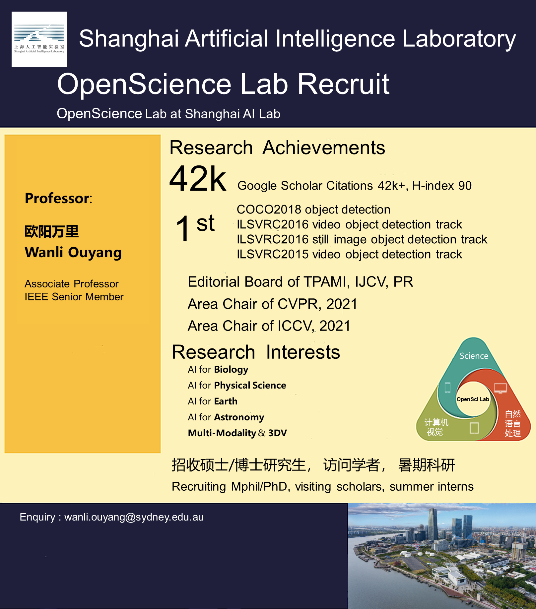

<!-- <object data="../guidelines/recruit_2024.png" type="application/pdf" width="800px" height="700px">
    <embed src="../guidelines/recruit_2024.png">
        
This browser does not support PDFs. Please download the PDF to view it: <a href="../guidelines/recruit_2024.png">Download PDF</a>.

    </embed>
</object> -->

We are always recruiting **M.Phil. or Ph.D.** students with strong academic background and solid programming skill. Before you apply, please first read the [**Application Guideline for AI4Science Group**](/guidelines/guideline_eng.pdf). For Chinese students, please refer to [**AI4Science Group招生简章**](/guidelines/ad.pdf) and [**AI4Science Group申请须知**](/guidelines/recruit_2024.png). You can send an email to [**wanli.ouyang[at]sydney.edu.au**](mailto:wanli.ouyang@sydney.edu.au) after you have read the guidelines carefully.

# Open Positions

## 人工智能驱动生命科学青年科学家/青年研究员
+ 岗位职责
    - 1.对蛋白质复合物结构预测等结构生物信息学相关的热点问题和人工智能算法进行研究；
    - 2.基于无监督、多模态等算法设计开发RNA语言模型、研究RNA三级结构预测；
    - 3.围绕基因组学中的关键问题展开新一代人工智能分析算法研究，包括变异检测、疾病关联、新一代测序技术以及病毒进化等；
    - 4.整合基因组学、转录组学、代谢组学和宏基因组学等数据，实现多组学数据与人工智能算法的交叉融合，研究药学、农学、医学领域的重大问题；
    - 5.对重大脑疾病诊断、脑认知功能分析等脑科学展开研究。
+ 任职资格
    - 1.国内外重点高等院校人工智能或生命科学相关专业博士学位，有学术会议/期刊论文发表经历者优先；
    - 2.人工智能相关专业需具备扎实的人工智能理论基础，有自然语言处理，多模态学习，大规模并行优化经验和计算机视觉的优先；
    - 3.生命科学相关专业需具备基因组学/转录组学/蛋白质组学基础理论计算研究能力，有多组学分析领域相关研究经验者优先；
    - 4.良好的沟通和协作能力，乐观主动，自驱性强；
    - 5.熟练使用C/C++、Python中至少一种编程语言；EE/CS相关专业的应聘者需掌握TensorFlow、PyTorch等深度学习框架之一。
    - 注：2和3满足一条即可。

## 人工智能驱动地球科学青年研究员
+ 岗位职责
    - 1.探索人工智能技术与地球科学（如大气海洋科学、地球物理等）相关自然科学研究课题的结合；
    - 2.探索数据驱动的人工智能方法与物理驱动的模式之间融合机制；
    - 3.在顶级学术会议或期刊（Nature、Science及核心子刊）上发表研究成果或解决地球科学领域的重大工程问题。 

+ 任职资格
    - 1.具有海内外著名高校地球物理、大气物理等相关专业博士学位或即将毕业。
    - 2.在相关领域有突出研究成果，如Nature、Science或重要子刊上的论文发表或大规模地球系统开发经历；
    - 3.对人工智能技术在地球科学中的应用感兴趣，并对人工智能技术有一定的了解；
    - 4.有强烈的好奇心及执行力，具备极强的自主探索、解决问题的能力和精神，针对研究过程中遇到的实际问题能够自主寻找解决方案。