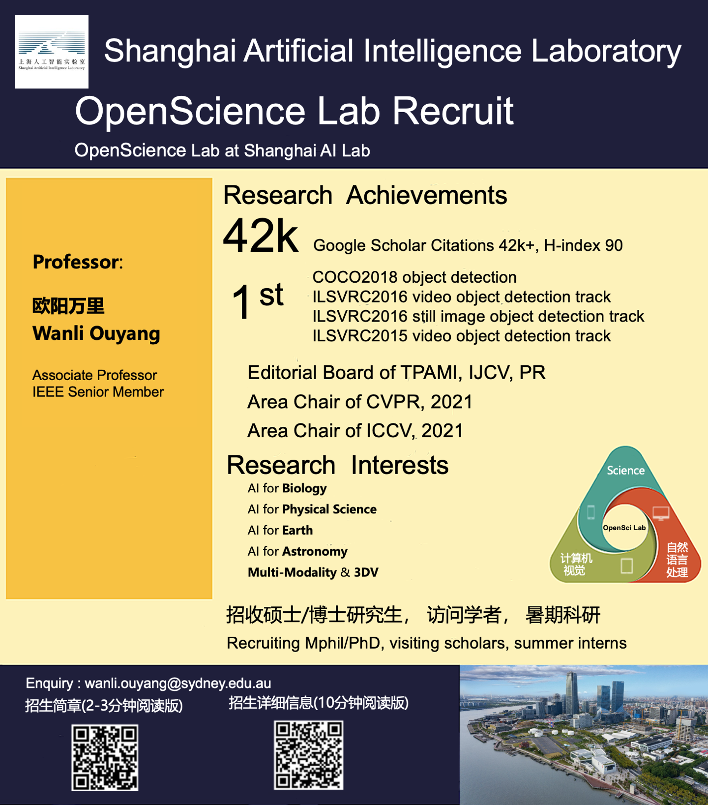

<!-- <object data="../guidelines/recruit_2024.png" type="application/pdf" width="700px" height="700px">
    <embed src="../guidelines/recruit_2024.png">
        
This browser does not support PDFs. Please download the PDF to view it: <a href="../guidelines/recruit_2024.png">Download PDF</a>.

    </embed>
</object> -->

We are always recruiting **M.Phil. or Ph.D.** students with strong academic background and solid programming skill. Before you apply, please first read the [**Application Guideline for AI4Science Group**](/guidelines/guideline_eng.pdf). For Chinese students, please refer to [**AI4Science Group招生简章**](/guidelines/ad.pdf) and [**AI4Science Group申请须知**](/guidelines/recruit_2024.png). You can send an email to [**sigma.usyd[at]gmail.com**](mailto:wanli.ouyang@sydney.edu.au) after you have read the guidelines carefully. 

Note that your email title should be formatted as "Affiliation_Name_Program". For example, if your name is Kevin and you are a student from the University of Sydney who intends to apply for the Ph.D. program, then your email title should be "USYD_Kevin_Ph.D.".

Currently, **we have no position for  postdoc researchers  and  research assistants  for our lab**.
